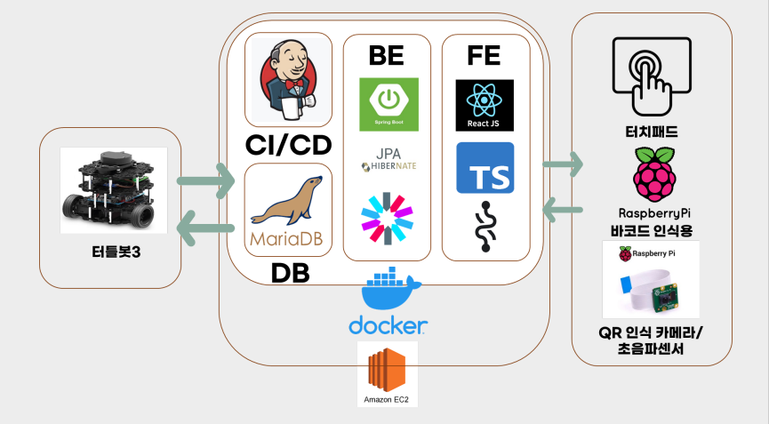
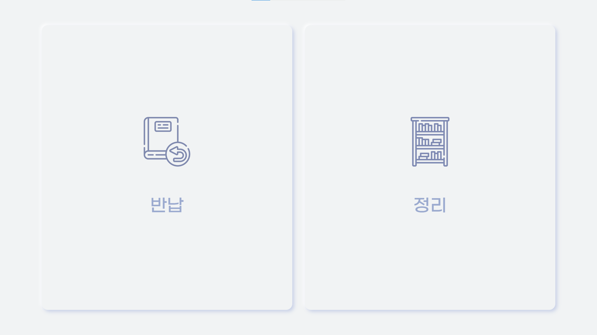
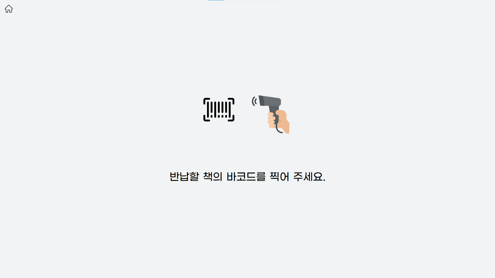
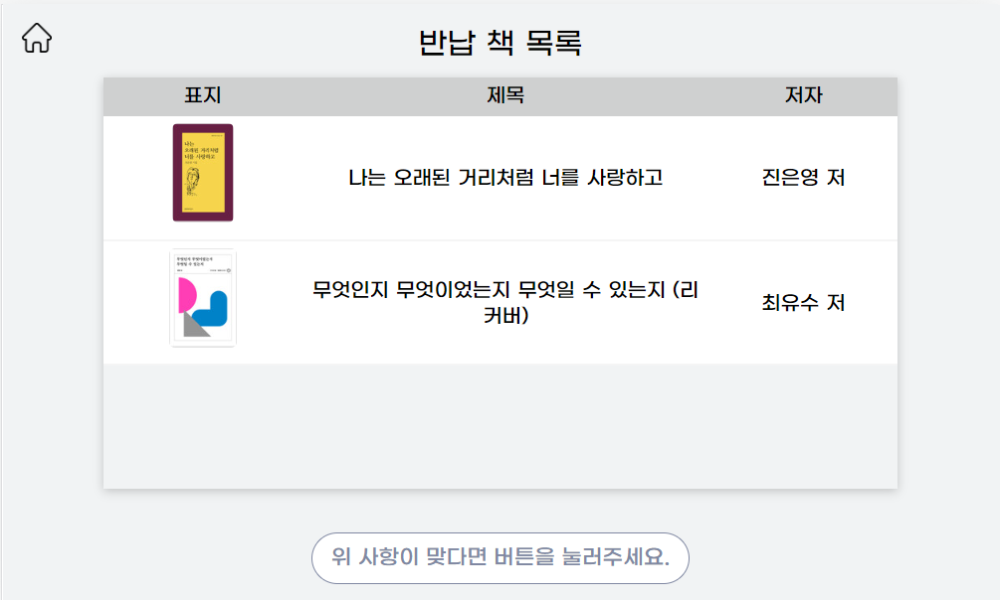
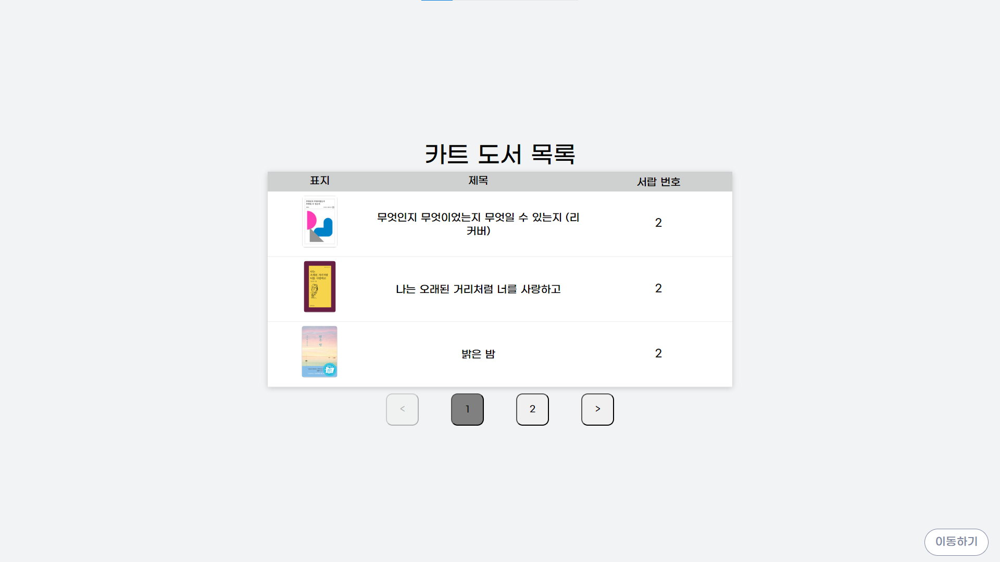
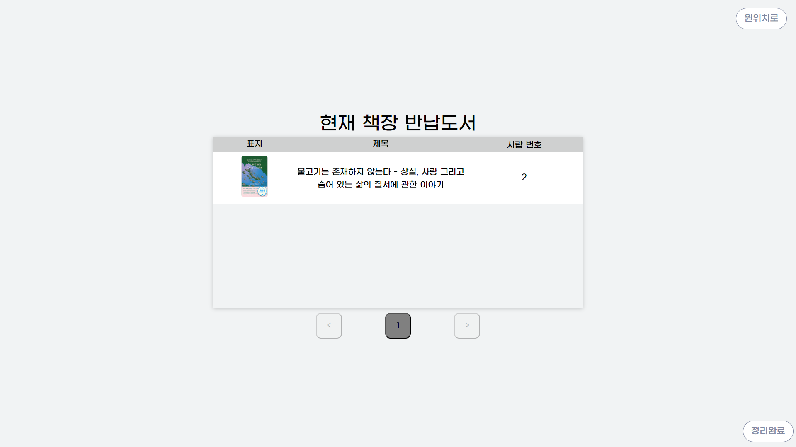
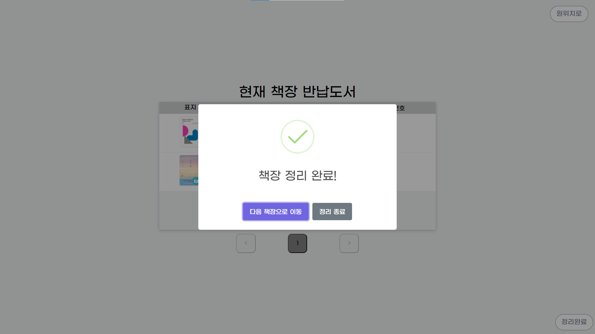
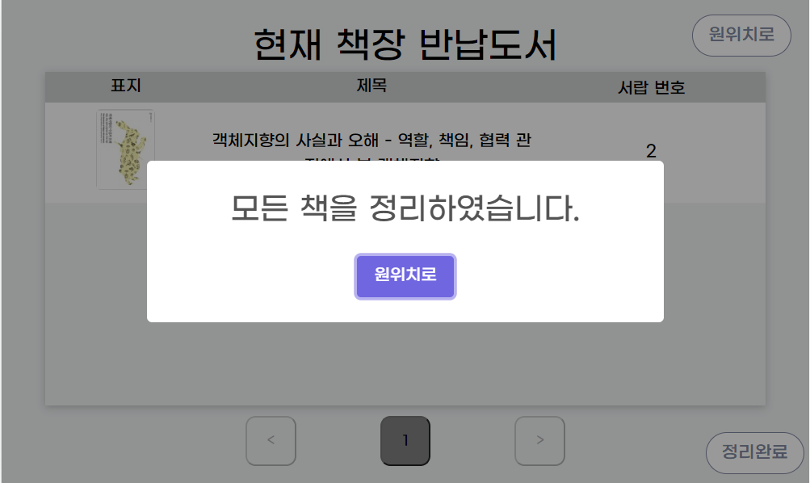
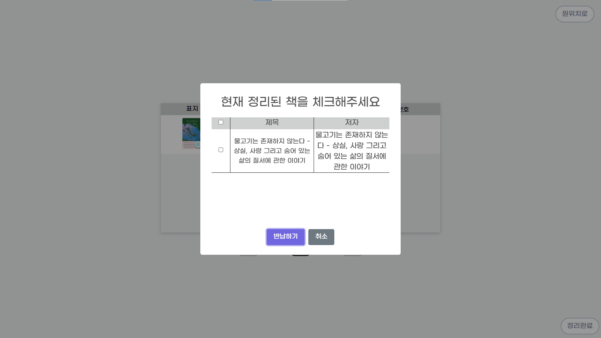

# DoCar
> 도서관 스마트 카트

> __PORORO(D101)__  
최종현, 김지현, 박정은, 신동윤, 이진성, 이햇살

> __개발 기간__: 2023.04.10 ~ 2023.05.19 (6주) 

<br>

## 팀원 역할
| 이름   | 역할 | 내용                        |
| ------ | ---- | --------------------------- |
| 최종현 | BE | 백앤드 개발, JWT 관리 |
| 김지현 | INFRA, IoT | 서버 구축, ROS 구현 |
| 박정은 | BE | 백앤드 개발, REST API 관리 |
| 신동윤 | INFRA, BE | 서버 구축, 백엔드 개발 |
| 이진성 | FE, IoT | 프론트엔드 개발, ROS 구현 |
| 이햇살 | FE, IoT | 프론트엔드 개발, 라즈베리파이 구현 |

<br>

### UCC ➡ [유튜브](https://www.youtube.com/watch?v=XqWZ3UWdW3c)
### 발표자료 ➡ [최종 발표자료](docs/구미_1반_D101_발표자료.pdf)
### Notion ➡ [노션](https://dent-asiago-e07.notion.site/D101-edc6bd849b91436abe5038a4d9b2465e)

<br>

-------

<br>

## 프로젝트 소개
```
로봇의 발전과 이에 따른 시장 구모가 확대가 되어있는 상황에서, 
다양한 분야로의 활용을 경험해보고자 도서관에 접목시켜 
책 정리를 위한 자율주행카트 개발을 실시함
```

<br>

## 개발환경
소통채널

- Mattermost
- Discord
- Notion
- FigJam

데이터베이스

- MariaDB : 10.11.2

서버

- AWS EC2
- Ubuntu : 20.04 LTS
- Docker : 23.0.4

Raspberry Pi

- Raspbian : GNU/Linux 11

이슈관리

- Jira

UI/UX

- Figma

형상관리

- GitLab

IDE

- IntelliJ IDEA : 2022.3.1
- Visual Studio Code : 1.74.2

기타 툴

- Postman : 10.13.5
- Swagger
- Jenkins

<br>

## 아키텍쳐



<br>

## 통신과정


<br>

## 기술스택

### Front-End
<div>
	
	
	
	
    
	
</div>

### Back-end
<div>
	
	
    
	
    
	
	
</div>

### IoT
<div>
	
	
</div>

### TEAM Cooperation
<div>
	
	
    
	
	
</div>

<br>

-----

<br>

## 서비스 및 기능 소개
### 대여했던 책을 반납하는 기능
- 바코드 리더기를 통해 현재 대여된 책을 반납 가능
- 도서관에서 읽은 책 중 대여되지 않은 책이라도 인식 시에 정리 카트에 추가
### 반납이 필요한 책을 반납해야하는 책장으로 최단거리로 이동하는 로직 구현
- BFS 알고리즘을 통해서 정리해야하는 책장을 최단거리로 리스트로 뽑아 해당 책장의 책 목록 출력
- socket으로 해당 책장의 번호를 터틀봇으로 전송
- 터틀봇에서 SLAM으로 그린 MAP에서 NAVIGATION기능을 통해 해당 책장 번호로 이동
### 해당 책장에서 반납이 필요한 책 위치를 카트에 네오픽셀로 표시
- 카트에서 정리해야하는 책의 인덱스를 리스트로 라스베리파이를 통해 네오픽셀의 불빛으로 위치 표시

<br>

## 화면 구성
### 메인페이지
<br>
- 반납이나 정리 가능

<br>
- 해당 페이지에서 바코드 리더기에서 책의 바코드를 통해 책을 반납

<br>
- 책을 인식 후에 각 선반의 용량에 따라 어느 선반에 위치하라는 안내
- 초음파 센서 상으로 책이 제대로 선반에 놓아지지 않을 시에 에러 출력

<br>
- 반납한 책을 모두 보이고, 정리 목록에 추가

<br>
- 메인에서 정리를 선택시에 관리자 로그인이 필요
- 출입증의 QR로 로그인

<br>
- 메인에서 정리를 선택시에 관리자 로그인이 필요
- 핀넘버로 로그인

<br>
- 관리자 로그인 후에 반납 카트에 있는 전체 도서 목록 출력
- 이동하기 버튼으로 책 정리 시작

<br>
- 정리해야하는 책들로 최단거리 구현 후 목적지의 책장의 책 목록 출력 

<br>
- 해당 책장에서 정리를 완료했다면 다음 책장으로 이동 가능

<br>
- 책을 모두 정리해 이동할 다음 책장이 없다면 원위치로 이동 가능

<br>
- 정리과정 중에 정리를 급종료 및 원위치로 이동해야할 때 사용
- 현재까지 정리한 책 목록 선택 후 해당 책 카트목록에서 삭제

<br>

## 디렉토리 구조

```bash
+---backend
|   |   .gitignore
|   |   build.gradle
|   |   Dockerfile
|   |   gradlew
|   |   gradlew.bat
|   |   settings.gradle
|   |
|   +---.gradle
|   |   |   file-system.probe
|   |   |
|   |   +---7.6.1
|   |   |   |   gc.properties
|   |   |   |
|   |   |   +---checksums
|   |   |   |       checksums.lock
|   |   |   |       md5-checksums.bin
|   |   |   |       sha1-checksums.bin
|   |   |   |
|   |   |   +---dependencies-accessors
|   |   |   |       dependencies-accessors.lock
|   |   |   |       gc.properties
|   |   |   |
|   |   |   +---executionHistory
|   |   |   |       executionHistory.bin
|   |   |   |       executionHistory.lock
|   |   |   |
|   |   |   +---fileChanges
|   |   |   |       last-build.bin
|   |   |   |
|   |   |   +---fileHashes
|   |   |   |       fileHashes.bin
|   |   |   |       fileHashes.lock
|   |   |   |       resourceHashesCache.bin
|   |   |   |
|   |   |   \---vcsMetadata
|   |   +---buildOutputCleanup
|   |   |       buildOutputCleanup.lock
|   |   |       cache.properties
|   |   |       outputFiles.bin
|   |   |
|   |   \---vcs-1
|   |           gc.properties
|   |
|   +---.idea
|   |   |   .gitignore
|   |   |   .name
|   |   |   compiler.xml
|   |   |   gradle.xml
|   |   |   jarRepositories.xml
|   |   |   misc.xml
|   |   |   modules.xml
|   |   |   vcs.xml
|   |   |   workspace.xml
|   |   |
|   |   \---modules
|   |           docar.main.iml
|   |
|   +---build
|   |   |   bootJarMainClassName
|   |   |
|   |   +---classes
|   |   |   \---java
|   |   |       +---main
|   |   |       |   \---com
|   |   |       |       \---pororo
|   |   |       |           \---docar
|   |   |       |               |   DocarApplication.class
|   |   |       |               |
|   |   |       |               +---common
|   |   |       |               |   +---dto
|   |   |       |               |   |       ApiResponse.class
|   |   |       |               |   |
|   |   |       |               |   \---exception
|   |   |       |               |           BadRequestException.class
|   |   |       |               |           ResourceAlreadyExistsException.class
|   |   |       |               |           ResourceForbiddenException.class
|   |   |       |               |           ResourceNotFoundException.class
|   |   |       |               |           UnAuthorizedException.class
|   |   |       |               |
|   |   |       |               +---config
|   |   |       |               |   |   OpenApiConfig.class
|   |   |       |               |   |   RestControllerExceptionHandler.class
|   |   |       |               |   |   SecurityConfig.class
|   |   |       |               |   |   WebSocketConfig$MyWebSocketHandler.class
|   |   |       |               |   |   WebSocketConfig.class
|   |   |       |               |   |
|   |   |       |               |   +---dto
|   |   |       |               |   |       CartBookList.class
|   |   |       |               |   |       SensorInfo.class
|   |   |       |               |   |
|   |   |       |               |   \---jwt
|   |   |       |               |           JwtConfiguration.class
|   |   |       |               |           JwtInterceptor.class
|   |   |       |               |           JwtProvider.class
|   |   |       |               |
|   |   |       |               \---domain
|   |   |       |                   +---admin
|   |   |       |                   |   +---controller
|   |   |       |                   |   |       AdminController.class
|   |   |       |                   |   |
|   |   |       |                   |   +---dto
|   |   |       |                   |   |       AdminChangePwDto$AdminChangePwDtoBuilder.class
|   |   |       |                   |   |       AdminChangePwDto.class
|   |   |       |                   |   |       AdminDto$AdminDtoBuilder.class
|   |   |       |                   |   |       AdminDto.class
|   |   |       |                   |   |       AdminLoginDto$AdminLoginDtoBuilder.class
|   |   |       |                   |   |       AdminLoginDto.class
|   |   |       |                   |   |       AdminQrLoginDto$AdminQrLoginDtoBuilder.class
|   |   |       |                   |   |       AdminQrLoginDto.class
|   |   |       |                   |   |       AdminResisterDto$AdminResisterDtoBuilder.class
|   |   |       |                   |   |       AdminResisterDto.class
|   |   |       |                   |   |
|   |   |       |                   |   +---entity
|   |   |       |                   |   |       Admin$AdminBuilder.class
|   |   |       |                   |   |       Admin.class
|   |   |       |                   |   |
|   |   |       |                   |   +---repository
|   |   |       |                   |   |       AdminRepository.class
|   |   |       |                   |   |
|   |   |       |                   |   \---service
|   |   |       |                   |           AdminService.class
|   |   |       |                   |
|   |   |       |                   +---book
|   |   |       |                   |   +---controller
|   |   |       |                   |   |       BookController.class
|   |   |       |                   |   |
|   |   |       |                   |   +---dto
|   |   |       |                   |   |       BookApiResponse$Item$SubInfo$Packing.class
|   |   |       |                   |   |       BookApiResponse$Item$SubInfo.class
|   |   |       |                   |   |       BookApiResponse$Item.class
|   |   |       |                   |   |       BookApiResponse.class
|   |   |       |                   |   |       BookDto$BookDtoBuilder.class
|   |   |       |                   |   |       BookDto$Items.class
|   |   |       |                   |   |       BookDto.class
|   |   |       |                   |   |
|   |   |       |                   |   +---entity
|   |   |       |                   |   |       Book$BookBuilder.class
|   |   |       |                   |   |       Book.class
|   |   |       |                   |   |
|   |   |       |                   |   +---repository
|   |   |       |                   |   |       BookRepository.class
|   |   |       |                   |   |
|   |   |       |                   |   \---service
|   |   |       |                   |           BookService.class
|   |   |       |                   |
|   |   |       |                   +---bookshelf
|   |   |       |                   |   +---controller
|   |   |       |                   |   |       BookshelfController.class
|   |   |       |                   |   |
|   |   |       |                   |   +---entity
|   |   |       |                   |   |       Bookshelf$BookshelfBuilder.class
|   |   |       |                   |   |       Bookshelf.class
|   |   |       |                   |   |
|   |   |       |                   |   +---repository
|   |   |       |                   |   |       BookshelfRepository.class
|   |   |       |                   |   |
|   |   |       |                   |   \---service
|   |   |       |                   |           BookshelfService.class
|   |   |       |                   |
|   |   |       |                   +---cartBook
|   |   |       |                   |   +---controller
|   |   |       |                   |   |       CartBookController.class
|   |   |       |                   |   |
|   |   |       |                   |   +---dto
|   |   |       |                   |   |       BookIds$BookIdsBuilder.class
|   |   |       |                   |   |       BookIds.class
|   |   |       |                   |   |       BookSetList$BookSetListBuilder.class
|   |   |       |                   |   |       BookSetList.class
|   |   |       |                   |   |
|   |   |       |                   |   +---entity
|   |   |       |                   |   |       CartBook$CartBookBuilder.class
|   |   |       |                   |   |       CartBook.class
|   |   |       |                   |   |
|   |   |       |                   |   +---repository
|   |   |       |                   |   |       CartBookRepository.class
|   |   |       |                   |   |
|   |   |       |                   |   \---service
|   |   |       |                   |           CartBookService.class
|   |   |       |                   |
|   |   |       |                   +---checkoutBook
|   |   |       |                   |   +---controller
|   |   |       |                   |   |       CheckoutBookController.class
|   |   |       |                   |   |
|   |   |       |                   |   +---dto
|   |   |       |                   |   |       borrowBookDto$borrowBookDtoBuilder.class
|   |   |       |                   |   |       borrowBookDto.class
|   |   |       |                   |   |
|   |   |       |                   |   +---entity
|   |   |       |                   |   |       CheckoutBook$CheckoutBookBuilder.class
|   |   |       |                   |   |       CheckoutBook.class
|   |   |       |                   |   |
|   |   |       |                   |   +---repository
|   |   |       |                   |   |       CheckoutBookRepository.class
|   |   |       |                   |   |
|   |   |       |                   |   \---service
|   |   |       |                   |           CheckoutBookService.class
|   |   |       |                   |
|   |   |       |                   +---tmpBook
|   |   |       |                   |   +---controller
|   |   |       |                   |   |       TmpBookController.class
|   |   |       |                   |   |
|   |   |       |                   |   +---dto
|   |   |       |                   |   |       TmpBookInfo.class
|   |   |       |                   |   |
|   |   |       |                   |   +---entity
|   |   |       |                   |   |       TmpBook$TmpBookBuilder.class
|   |   |       |                   |   |       TmpBook.class
|   |   |       |                   |   |
|   |   |       |                   |   +---repository
|   |   |       |                   |   |       TmpBookRepository.class
|   |   |       |                   |   |
|   |   |       |                   |   \---service
|   |   |       |                   |           TmpBookService.class
|   |   |       |                   |
|   |   |       |                   \---user
|   |   |       |                       +---controller
|   |   |       |                       |       UserController.class
|   |   |       |                       |
|   |   |       |                       +---dto
|   |   |       |                       |       UserCreateRequest.class
|   |   |       |                       |       UserSimpleInfo.class
|   |   |       |                       |
|   |   |       |                       +---entity
|   |   |       |                       |       User$UserBuilder.class
|   |   |       |                       |       User.class
|   |   |       |                       |
|   |   |       |                       +---repository
|   |   |       |                       |       UserRepository.class
|   |   |       |                       |
|   |   |       |                       \---service
|   |   |       |                               UserService.class
|   |   |       |
|   |   |       \---test
|   |   |           \---com
|   |   |               \---pororo
|   |   |                   \---docar
|   |   |                           DocarApplicationTests.class
|   |   |
|   |   +---generated
|   |   |   \---sources
|   |   |       +---annotationProcessor
|   |   |       |   \---java
|   |   |       |       +---main
|   |   |       |       \---test
|   |   |       \---headers
|   |   |           \---java
|   |   |               +---main
|   |   |               \---test
|   |   +---libs
|   |   |       docar-0.0.1-SNAPSHOT-plain.jar
|   |   |       docar-0.0.1-SNAPSHOT.jar
|   |   |
|   |   +---reports
|   |   |   \---tests
|   |   |       \---test
|   |   |           |   index.html
|   |   |           |
|   |   |           +---classes
|   |   |           |       com.pororo.docar.DocarApplicationTests.html
|   |   |           |
|   |   |           +---css
|   |   |           |       base-style.css
|   |   |           |       style.css
|   |   |           |
|   |   |           +---js
|   |   |           |       report.js
|   |   |           |
|   |   |           \---packages
|   |   |                   com.pororo.docar.html
|   |   |
|   |   +---resources
|   |   |   +---main
|   |   |   |       application.yml
|   |   |   |
|   |   |   \---test
|   |   |           application.yml
|   |   |
|   |   +---test-results
|   |   |   \---test
|   |   |       |   TEST-com.pororo.docar.DocarApplicationTests.xml
|   |   |       |
|   |   |       \---binary
|   |   |               output.bin
|   |   |               output.bin.idx
|   |   |               results.bin
|   |   |
|   |   \---tmp
|   |       +---bootJar
|   |       |       MANIFEST.MF
|   |       |
|   |       +---compileJava
|   |       |       previous-compilation-data.bin
|   |       |
|   |       +---compileTestJava
|   |       |       previous-compilation-data.bin
|   |       |
|   |       +---jar
|   |       |       MANIFEST.MF
|   |       |
|   |       \---test
|   +---gradle
|   |   \---wrapper
|   |           gradle-wrapper.jar
|   |           gradle-wrapper.properties
|   |
|   \---src
|       +---main
|       |   +---java
|       |   |   \---com
|       |   |       \---pororo
|       |   |           \---docar
|       |   |               |   DocarApplication.java
|       |   |               |
|       |   |               +---common
|       |   |               |   +---dto
|       |   |               |   |       ApiResponse.java
|       |   |               |   |
|       |   |               |   \---exception
|       |   |               |           BadRequestException.java
|       |   |               |           ResourceAlreadyExistsException.java
|       |   |               |           ResourceForbiddenException.java
|       |   |               |           ResourceNotFoundException.java
|       |   |               |           UnAuthorizedException.java
|       |   |               |
|       |   |               +---config
|       |   |               |   |   OpenApiConfig.java
|       |   |               |   |   RestControllerExceptionHandler.java
|       |   |               |   |   SecurityConfig.java
|       |   |               |   |   WebSocketConfig.java
|       |   |               |   |
|       |   |               |   +---dto
|       |   |               |   |       CartBookList.java
|       |   |               |   |       SensorInfo.java
|       |   |               |   |
|       |   |               |   \---jwt
|       |   |               |           JwtConfiguration.java
|       |   |               |           JwtInterceptor.java
|       |   |               |           JwtProvider.java
|       |   |               |
|       |   |               \---domain
|       |   |                   +---admin
|       |   |                   |   +---controller
|       |   |                   |   |       AdminController.java
|       |   |                   |   |
|       |   |                   |   +---dto
|       |   |                   |   |       AdminChangePwDto.java
|       |   |                   |   |       AdminDto.java
|       |   |                   |   |       AdminLoginDto.java
|       |   |                   |   |       AdminQrLoginDto.java
|       |   |                   |   |       AdminResisterDto.java
|       |   |                   |   |
|       |   |                   |   +---entity
|       |   |                   |   |       Admin.java
|       |   |                   |   |
|       |   |                   |   +---repository
|       |   |                   |   |       AdminRepository.java
|       |   |                   |   |
|       |   |                   |   \---service
|       |   |                   |           AdminService.java
|       |   |                   |
|       |   |                   +---book
|       |   |                   |   +---controller
|       |   |                   |   |       BookController.java
|       |   |                   |   |
|       |   |                   |   +---dto
|       |   |                   |   |       BookApiResponse.java
|       |   |                   |   |       BookDto.java
|       |   |                   |   |
|       |   |                   |   +---entity
|       |   |                   |   |       Book.java
|       |   |                   |   |
|       |   |                   |   +---repository
|       |   |                   |   |       BookRepository.java
|       |   |                   |   |
|       |   |                   |   \---service
|       |   |                   |           BookService.java
|       |   |                   |
|       |   |                   +---bookshelf
|       |   |                   |   +---controller
|       |   |                   |   |       BookshelfController.java
|       |   |                   |   |
|       |   |                   |   +---entity
|       |   |                   |   |       Bookshelf.java
|       |   |                   |   |
|       |   |                   |   +---repository
|       |   |                   |   |       BookshelfRepository.java
|       |   |                   |   |
|       |   |                   |   \---service
|       |   |                   |           BookshelfService.java
|       |   |                   |
|       |   |                   +---cartBook
|       |   |                   |   +---controller
|       |   |                   |   |       CartBookController.java
|       |   |                   |   |
|       |   |                   |   +---dto
|       |   |                   |   |       BookIds.java
|       |   |                   |   |       BookSetList.java
|       |   |                   |   |
|       |   |                   |   +---entity
|       |   |                   |   |       CartBook.java
|       |   |                   |   |
|       |   |                   |   +---repository
|       |   |                   |   |       CartBookRepository.java
|       |   |                   |   |
|       |   |                   |   \---service
|       |   |                   |           CartBookService.java
|       |   |                   |
|       |   |                   +---checkoutBook
|       |   |                   |   +---controller
|       |   |                   |   |       CheckoutBookController.java
|       |   |                   |   |
|       |   |                   |   +---dto
|       |   |                   |   |       borrowBookDto.java
|       |   |                   |   |
|       |   |                   |   +---entity
|       |   |                   |   |       CheckoutBook.java
|       |   |                   |   |
|       |   |                   |   +---repository
|       |   |                   |   |       CheckoutBookRepository.java
|       |   |                   |   |
|       |   |                   |   \---service
|       |   |                   |           CheckoutBookService.java
|       |   |                   |
|       |   |                   +---tmpBook
|       |   |                   |   +---controller
|       |   |                   |   |       TmpBookController.java
|       |   |                   |   |
|       |   |                   |   +---dto
|       |   |                   |   |       TmpBookInfo.java
|       |   |                   |   |
|       |   |                   |   +---entity
|       |   |                   |   |       TmpBook.java
|       |   |                   |   |
|       |   |                   |   +---repository
|       |   |                   |   |       TmpBookRepository.java
|       |   |                   |   |
|       |   |                   |   \---service
|       |   |                   |           TmpBookService.java
|       |   |                   |
|       |   |                   \---user
|       |   |                       +---controller
|       |   |                       |       UserController.java
|       |   |                       |
|       |   |                       +---dto
|       |   |                       |       UserCreateRequest.java
|       |   |                       |       UserSimpleInfo.java
|       |   |                       |
|       |   |                       +---entity
|       |   |                       |       User.java
|       |   |                       |
|       |   |                       +---repository
|       |   |                       |       UserRepository.java
|       |   |                       |
|       |   |                       \---service
|       |   |                               UserService.java
|       |   |
|       |   \---resources
|       |           application.yml
|       |
|       \---test
|           +---java
|           |   \---com
|           |       \---pororo
|           |           \---docar
|           |                   DocarApplicationTests.java
|           |
|           \---resources
|                   application.yml
|
+---config
|   |   README.md
|   |
|   \---backend
|           application.yml
|
+---docs
|   |   .gitkeep
|   |   구미_1반_D101_발표자료.pdf
|   |   자율PJT_구미_1반_D101_UCC경진대회.mp4
|   |
|   \---imgs
|           .gitkeep
|           all_done.png
|           architecture.png
|           cart_done.png
|           cart_list.png
|           go_home.png
|           login_pin.png
|           login_qr.png
|           main.png
|           present_return.png
|           return.png
|           return_book.png
|           return_list.png
|           websocket.png
|
+---exec
|   |   .gitkeep
|   |   01_포팅 매뉴얼.pdf
|   |   02._프로젝트에서_사용하는_외부_서비스_정보를_정리한_문서.md
|   |   04_시연_시나리오.pptx
|   |
|   \---03_DB 덤프 파일
|           docar.sql
|
+---frontend
|   |   .gitignore
|   |   .prettierrc.yml
|   |   Dockerfile
|   |   nginx.conf
|   |   package-lock.json
|   |   package.json
|   |   README.md
|   |   tsconfig.json
|   |
|   +---public
|   |       favicon.ico
|   |       index.html
|   |       logo192.png
|   |       logo512.png
|   |       robots.txt
|   |
|   \---src
|       |   App.css
|       |   App.tsx
|       |   index.css
|       |   index.tsx
|       |   react-app-env.d.ts
|       |   Router.tsx
|       |   socket.js
|       |
|       +---Presentational
|       |   +---Common
|       |   |   |   Btn.tsx
|       |   |   |   HomeBtn.tsx
|       |   |   |   Modal.tsx
|       |   |   |   MoveShelf.tsx
|       |   |   |
|       |   |   \---Cleanup
|       |   |           MoveShelf.tsx
|       |   |
|       |   +---Components
|       |   |   |   BookData.json
|       |   |   |   BookTable.tsx
|       |   |   |   BookTableBack.tsx
|       |   |   |   BookTableCheck.tsx
|       |   |   |   BookTableChecked.tsx
|       |   |   |   BookTable_Style.tsx
|       |   |   |   Pagenation.tsx
|       |   |   |   Pagenation_Style.tsx
|       |   |   |   ReturnBookTable.tsx
|       |   |   |   TableItem.tsx
|       |   |   |
|       |   |   +---Cleanup
|       |   |   |       BookItem.tsx
|       |   |   |       BookList.tsx
|       |   |   |       BookList_Style.tsx
|       |   |   |       Bookshelf.tsx
|       |   |   |       EndCleanup.tsx
|       |   |   |
|       |   |   +---Login
|       |   |   |       LoginError.tsx
|       |   |   |       PinLogin.tsx
|       |   |   |       QrLogin.tsx
|       |   |   |
|       |   |   \---Return
|       |   |           ReturnBooks.tsx
|       |   |           ReturnBooks_Style.tsx
|       |   |           ReturnDetail.tsx
|       |   |           ReturnDetail_Style.tsx
|       |   |           ReturnList.tsx
|       |   |           ReturnList_Style.tsx
|       |   |           ReturnQrcode.tsx
|       |   |           ReturnQrcode_Style.tsx
|       |   |
|       |   +---layout
|       |   |       Layout.tsx
|       |   |
|       |   \---Pages
|       |           CleanupPage.tsx
|       |           CleanupPage_Style.tsx
|       |           LoginPage.tsx
|       |           LoginPage_Style.tsx
|       |           MainPage.tsx
|       |           MainPage_Style.tsx
|       |           ReturnPage.tsx
|       |           ReturnPage_Style.tsx
|       |
|       +---Resources
|       |   \---Images
|       |           barcode.png
|       |           BookImage.jpg
|       |           bookshelf.png
|       |           defaultImage.png
|       |           home.png
|       |           qrcode.png
|       |           return.png
|       |           scanner.png
|       |
|       +---store
|       |       api.ts
|       |       atoms.ts
|       |       types.ts
|       |
|       \---types
|               image.d.ts
|
\---turtlebot3
    \---forward1
        |   package.xml
        |   setup.cfg
        |   setup.py
        |
        +---forward1
        |   |   amcl1.py
        |   |   amcl2.py
        |   |   forward1_1.py
        |   |   forward1_2.py
        |   |   tb3_navigation.py
        |   |   test1.py
        |   |   __init__.py
        |   |
        |   \---__pycache__
        |           amcl1.cpython-38.pyc
        |           amcl2.cpython-38.pyc
        |           forward1_1.cpython-38.pyc
        |           forward1_2.cpython-38.pyc
        |           tb3_navigation.cpython-38.pyc
        |           test1.cpython-38.pyc
        |           __init__.cpython-38.pyc
        |
        +---launch
        |   |   load_turtlebot_map.launch.py
        |   |   turtlebot3_navigation2.launch.py
        |   |
        |   \---__pycache__
        |           turtlebot3_navigation2.launch.cpython-38.pyc
        |
        +---params
        |       nav2_params.yaml
        |
        +---resource
        |       forward1
        |
        \---test
                test_copyright.py
                test_flake8.py
                test_pep257.py
```
